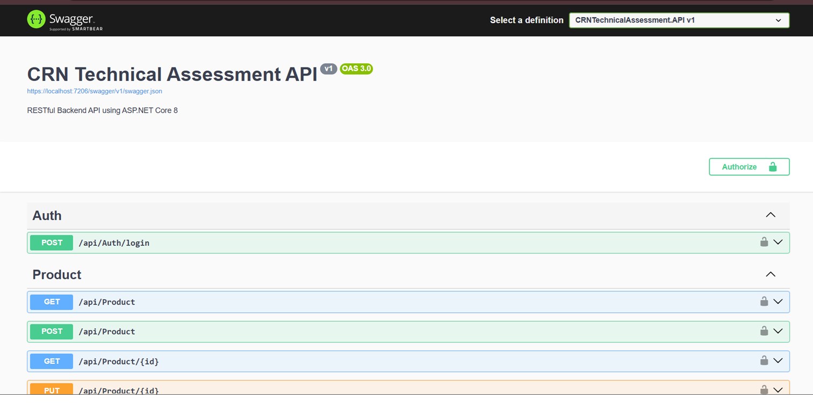
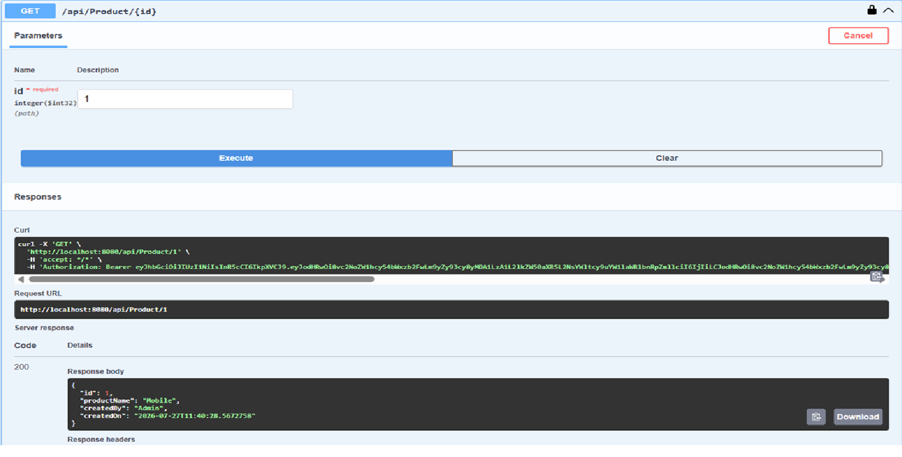
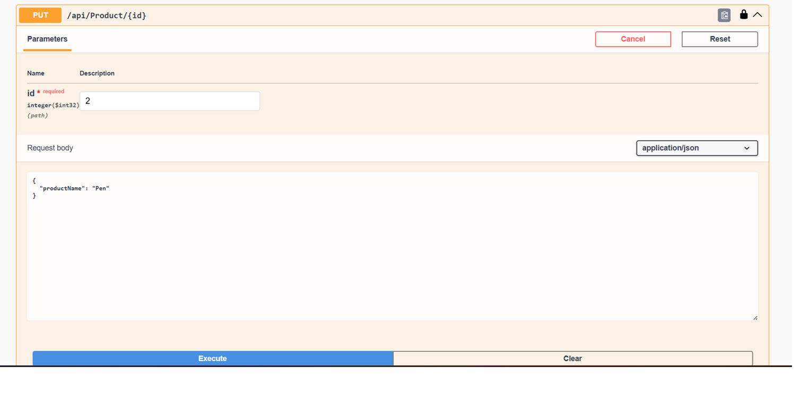
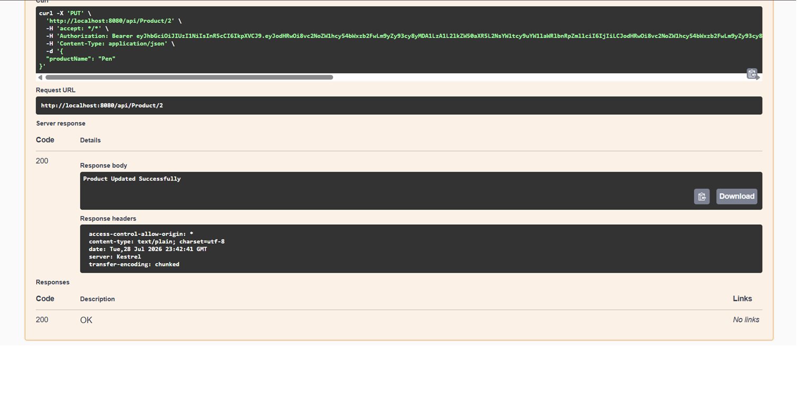
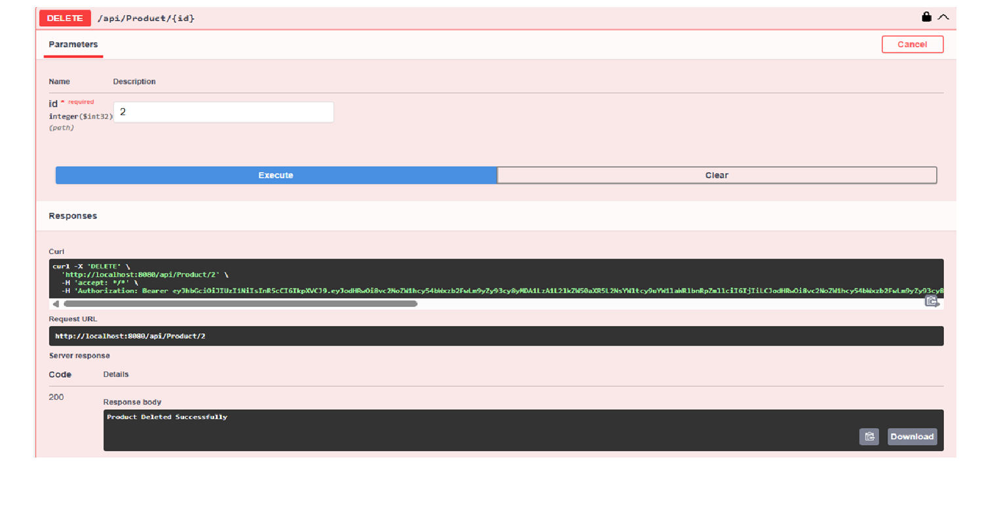

# CRN Technical Assessment

## Overview

This project is a RESTful Web API developed using **.NET 8** and **ASP.NET Core Web API** as part of the **CRN Technical Assessment**.

The application implements secure Product CRUD operations using **JWT Authentication**, **Entity Framework Core**, **SQL Server**, **Repository Pattern**, **Unit of Work**, **FluentValidation**, **Global Exception Handling**, **Swagger Documentation**, and **Docker**.

---

# Features

- JWT Authentication
- Refresh Token Authentication
- Product CRUD Operations
- Entity Framework Core
- Repository Pattern
- Unit of Work Pattern
- FluentValidation
- Global Exception Middleware
- Swagger Documentation
- Docker & Docker Compose
- SQL Server Integration
- Clean Architecture
- Dependency Injection
- Structured Logging
- Unit Testing using xUnit & Moq

---

# Tech Stack

| Technology | Version |
|------------|----------|
| .NET | 8 |
| ASP.NET Core Web API | 8 |
| Entity Framework Core | 8 |
| SQL Server | Latest |
| JWT Authentication | ✔ |
| FluentValidation | ✔ |
| AutoMapper | ✔ |
| Swagger | ✔ |
| Docker | ✔ |
| xUnit | ✔ |
| Moq | ✔ |

---

# High Level Architecture

```

Client
│
Swagger / Postman
│
Controllers
│
Application Services
│
Repository Pattern
│
Entity Framework Core
│
SQL Server

```

---

# Project Structure

```

CRNTechnicalAssessment

├── CRNTechnicalAssessment.API
├── CRNTechnicalAssessment.Application
├── CRNTechnicalAssessment.Domain
├── CRNTechnicalAssessment.Infrastructure
├── CRNTechnicalAssessment.Tests
├── Dockerfile
├── docker-compose.yml
└── README.md

```

---

# Authentication

## Login Endpoint

```

POST /api/Auth/login

```

### Sample Request

```json
{
  "userName": "admin",
  "password": "Pass@123"
}
```

### Sample Response

```json
{
  "accessToken": "...",
  "refreshToken": "...",
  "expiration": "..."
}
```

---

# Product API Endpoints

| Method | Endpoint |
|---------|-------------------------|
| GET | /api/Product |
| GET | /api/Product/{id} |
| POST | /api/Product |
| PUT | /api/Product/{id} |
| DELETE | /api/Product/{id} |

---

# Running the Project

## Clone Repository

```bash
git clone https://github.com/sachin7161/CRNTechnicalAssessment.git
```

## Open Solution

```
Visual Studio 2022
```

## Restore Packages

```bash
dotnet restore
```

## Build Project

```bash
dotnet build
```

## Run the Project

```bash
dotnet run
```

or simply press

```
F5
```

---

# Swagger

### Local

```
https://localhost:7206/swagger
```

---

# Docker

## Build & Run

```bash
docker compose up --build
```

or

```bash
docker-compose up --build
```

## Docker Swagger

```
http://localhost:8080/swagger
```

---

# Running Unit Tests

```bash
dotnet test
```

### Test Result

```
Total Tests : 8

Passed : 8

Failed : 0

Skipped : 0
```

---

# Security

- JWT Authentication
- Refresh Token Strategy
- HTTPS Support
- CORS Configuration
- FluentValidation
- Global Exception Handling
- Dependency Injection

---

# Screenshots

## Swagger Home



---

## Login Request


---

## Login Success


---

## JWT Authorization


---

## Get All Products


---

## Get Product By Id



---

## Create Product Request


---

## Create Product Success


---

## Update Product Request



---

## Update Product Success



---

## Delete Product



---

# Author

## Sachin Kalel

**.NET Full Stack Developer**

📧 Email  
sachin.kalel@hotmail.com

🔗 GitHub  
https://github.com/sachin7161

🔗 LinkedIn  
https://www.linkedin.com/in/sachin7161

---

## Thank You

Thank you for reviewing my technical assessment.

I appreciate your time and consideration.
